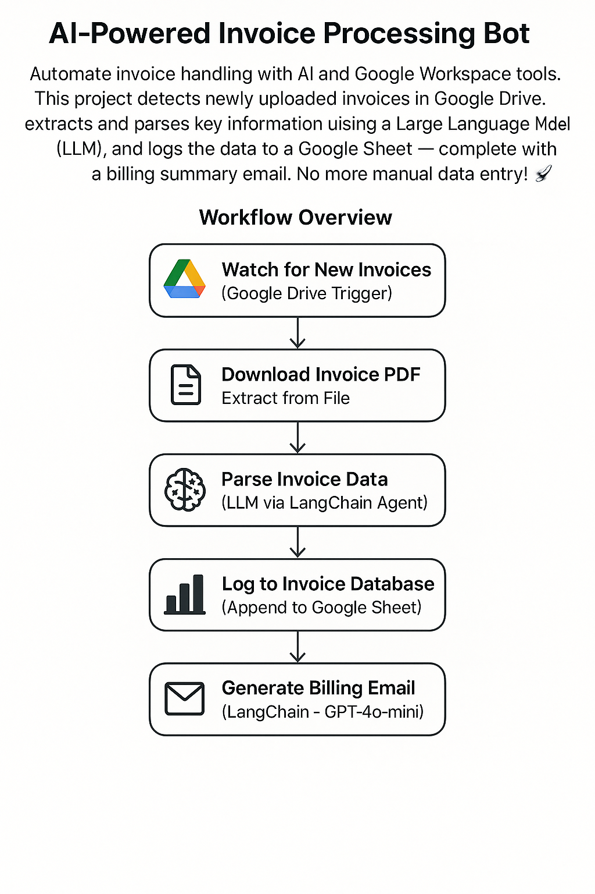

# 📄 AI-Powered Invoice Processing Bot

Automate invoice handling with AI and Google Workspace tools. This project detects newly uploaded invoices in Google Drive, extracts and parses key information using a Large Language Model (LLM), and logs the data to a Google Sheet — complete with a billing summary email.  
No more manual data entry! 🚀




---

## 🔧 Workflow Overview

1. **📥 Watch for New Invoices**  
   _Trigger_: `fileCreated` event in a specific Google Drive folder  
   _Tool_: Google Drive Trigger  
   ➤ Begins the workflow when a new PDF is uploaded.

2. **📎 Download Invoice PDF**  
   _Tool_: Download Binary  
   ➤ Downloads the uploaded PDF invoice file.

3. **🧾 Extract PDF Text**  
   _Tool_: Extract from File  
   ➤ Extracts raw unstructured text content from the PDF.

4. **🧠 Parse Invoice Data with LLM**  
   _Tool_: LangChain Agent (LLM)  
   ➤ Extracts structured data from raw text using prompts:

   - Invoice Number
   - Client Name, Email, Address, Phone
   - Invoice Date, Due Date, Total Amount  
     ➤ Skips missing fields gracefully.

5. **📊 Log to Invoice Database**  
   _Tool_: Google Sheets  
   ➤ Appends extracted data to a designated Google Sheet.

6. **📧 Generate Billing Email Summary**  
   _Tool_: LangChain Agent (GPT-4o-mini)  
   ➤ Crafts a professional billing summary email:
   - From: _Greenie_ at Green Grass Corp
   - Message: Notifies billing that the invoice was processed and logged.

---

## 🛠️ Tech Stack

- **Google Drive API** — File monitoring & downloading
- **LangChain + GPT-4o-mini** — Natural language invoice parsing & summary generation
- **Google Sheets API** — Invoice data logging
- **PDF Extractor** — Unstructured text extraction

---

## ✅ Features

- End-to-end automation of invoice processing
- AI-powered field extraction (robust to format variation)
- Hands-free data logging into Google Sheets
- Dynamic, LLM-generated billing notifications
- Scalable & extensible with new AI models and integrations

---

## 🚀 Getting Started

1. **Clone this repo:**

   ```bash
   git clone https://github.com/macwindow10/extract_invoice_pdf_from_googledrive_ollama.git
   cd extract_invoice_pdf_from_googledrive_ollama
   ```

2. **Set up credentials:**

   - Configure Google Drive and Google Sheets API credentials
   - Ensure Ollama Models Running Locally

3. **Deploy your workflow:**
   - Use your preferred automation platform (e.g., n8n, Make, or custom orchestrator)
   - Import and enable the workflow file

---

## 💡 Example Use Case

> _Upload an invoice from a supplier to your "Incoming Invoices" folder. Within seconds, the bot logs the details to your invoice spreadsheet and notifies billing — fully automated._

---

## 🧩 Coming Soon

- OCR support for scanned invoices 🖨️
- Slack integration for alerts and notifications

---

## 👨‍💻 Author

**Green Grass Corp – Automation Team**  
📧 [mac.window.10@gmail.com](mailto:mac.window.10@gmail.com)

---

## 📜 License

MIT License. See `LICENSE` for details.
